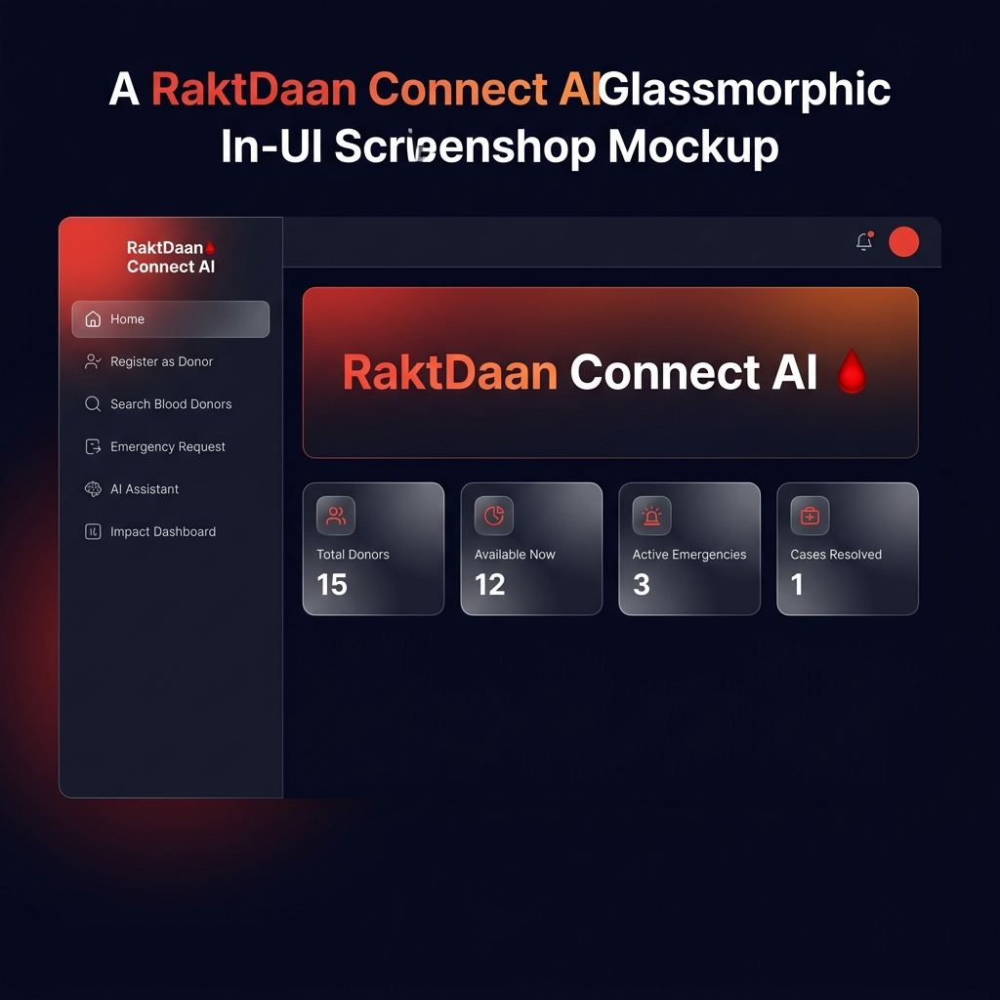
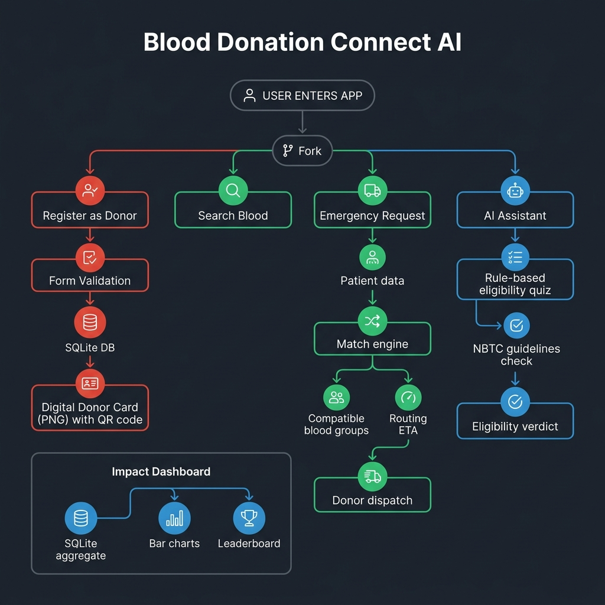
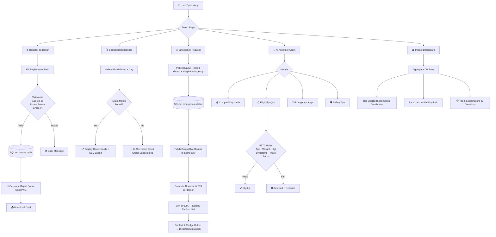
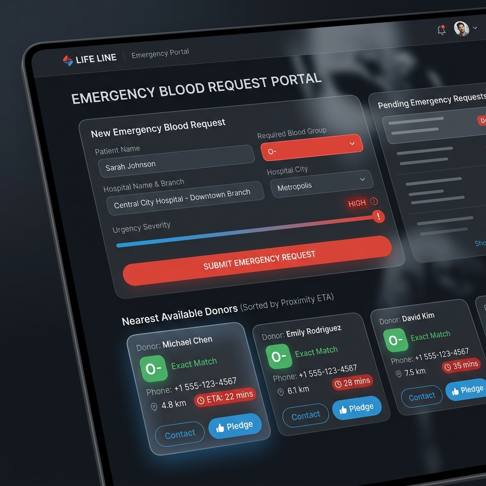
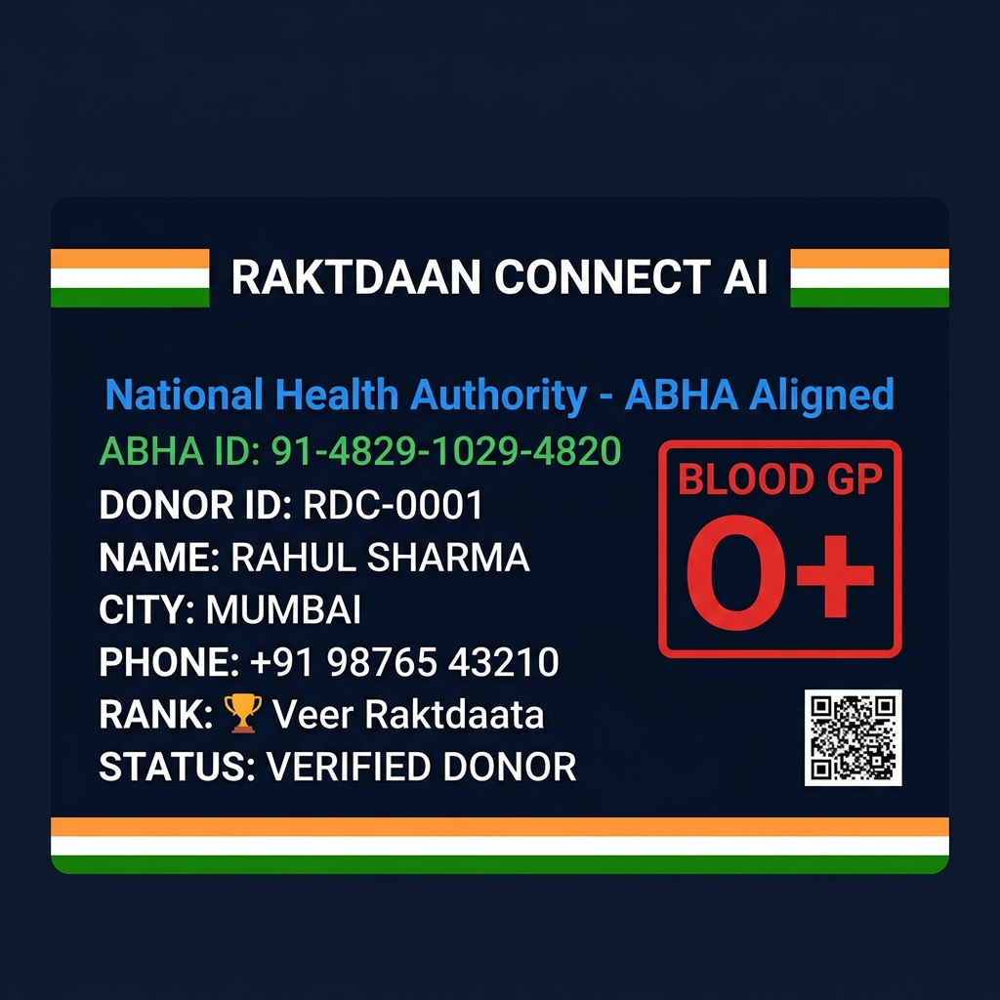
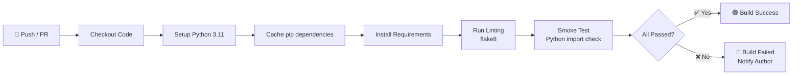

<div align="center">



# 🩸 Blood Donation Connect AI

### *RaktDaan Connect — India's Intelligent Emergency Blood Network*

[](https://python.org)
[](https://streamlit.io)
[](https://sqlite.org)
[](https://pillow.readthedocs.io)
[](LICENSE)
[](https://github.com/rishitha0208/blood-donation-connect-ai/actions)

**Track:** Agents for Good  
**Tech Stack:** Python · Streamlit · SQLite · Pillow · Pandas  
**Target Region:** India 🇮🇳

[🚀 Quick Start](#-how-to-run-locally) · [📖 Features](#-key-features) · [🏗️ Architecture](#-system-architecture) · [📊 Screenshots](#-screenshots) · [🔗 GitHub](https://github.com/rishitha0208/blood-donation-connect-ai)

</div>

---

## 📌 About the Project

**Blood Donation Connect AI** (RaktDaan Connect) is an intelligent, rule-based blood donor coordination platform designed to **solve critical real-time communication gaps during medical emergencies in India**.

Every year, thousands of patients in Indian hospitals face life-threatening situations due to acute blood shortages. Traditional methods of finding donors — phone trees, WhatsApp groups, or manual coordination — are slow, unreliable, and error-prone. **RaktDaan Connect AI** bridges this gap by combining:

- 🔍 **Smart proximity-based donor matching** using simulated ETA routing
- 🤖 **Rule-based AI eligibility screening** following NBTC (National Blood Transfusion Council) and WHO guidelines
- 🪪 **ABHA-aligned digital donor ID cards** generated on-the-fly
- 🏆 **Gamification** to encourage repeat donations through tiered badge rewards
- 📊 **Real-time impact dashboards** with live metrics from a local SQLite database

> **No API keys needed. No cloud dependency. Everything runs locally and offline-ready.**

---

## 🌟 Key Features

### 1. 🚨 Emergency Blood Request & Proximity ETA Simulator
- File a patient emergency with blood group, hospital name, and city
- The matching engine fetches compatible donors from the local database
- Computes deterministic distance (km) and simulated ETA (minutes) for each nearby donor
- Sorts donors by estimated arrival time and enables one-click **Contact & Pledge** dispatch

### 2. 🪪 Digital Donor Card Generator
- Generates a customized, high-quality **Official Donor ID Card** (PNG) on registration
- ABHA ID integration (Ayushman Bharat Health Account format `91-XXXX-XXXX-XXXX`)
- Features Indian tricolor ribbon, blood group stamp, donor rank badge, mock QR code
- Downloadable instantly as a PNG file

### 3. 🤖 Rule-Based AI Assistant Agent
- **Blood Group Compatibility Matrix** — interactive receive/give analysis for all 8 blood groups
- **Smart Eligibility Quiz** — pre-screens donors on age, weight, hemoglobin, symptoms, travel, and tattoo/surgery history against NBTC guidelines
- **Emergency Response Steps** — step-by-step coordination protocol for hospital coordinators
- **Donation Safety Tips** — pre/during/post donation guidelines

### 4. 🔍 Blood Donor Search Directory
- Query the active donor database by blood group and city
- Displays donor name, age, last donation date, badge rank, ABHA ID, and availability status
- **AI-powered alternative suggestions** when exact blood type is unavailable
- Export matched donor list as CSV

### 5. 🏆 Gamification & Leaderboard
| Tier | Donations | Badge |
|------|-----------|-------|
| 🌱 Rakt Rookie | 0 | Registered potential donor |
| 🩸 Rakt Sevak | 1 | Completed first donation |
| 🛡️ Sanjeevani Warrior | 2–3 | Supporting emergency network |
| 🏆 Veer Raktdaata | 4–5 | Outstanding contributor |
| 🌟 Maha Donor | 6+ | Lifesaving legend |

### 6. 📊 Analytical Impact Dashboard
- Real-time aggregated metrics: total donors, available donors, active emergencies, resolved cases
- Blood group distribution bar charts
- Donor availability ratio visualization
- Community leaderboard top-5

---

## 🏗️ System Architecture

<div align="center">

</div>

### Application Flow



### Technology Stack

```
┌──────────────────────────────────────────────────┐
│                  FRONTEND LAYER                  │
│   Streamlit UI (Python) + Custom CSS (Dark Mode) │
└───────────────────────┬──────────────────────────┘
                        │
┌───────────────────────▼──────────────────────────┐
│               APPLICATION LAYER                  │
│  app.py ──── 6 Pages ──── Session State Routing  │
│  ├── Home Dashboard                              │
│  ├── Donor Registration (with PIL Card Generator)│
│  ├── Blood Donor Search (with AI Fallback)       │
│  ├── Emergency Request (with ETA Engine)         │
│  ├── AI Assistant Agent (Rule-based)             │
│  └── Impact Dashboard (Charts + Leaderboard)    │
└────────┬──────────────────────┬──────────────────┘
         │                      │
┌────────▼────────┐   ┌─────────▼────────────────┐
│  ai_assistant.py│   │      database.py          │
│  Rule-based AI  │   │  SQLite ORM Layer         │
│  ├── Eligibility│   │  ├── init_db()            │
│  ├── Compat Mtx │   │  ├── register_donor()     │
│  ├── ETA Sim    │   │  ├── search_donors()      │
│  └── Gamification│  │  ├── create_emergency()   │
└────────┬────────┘   │  └── get_dashboard_stats()│
         │             └──────────┬───────────────┘
         │                        │
┌────────▼────────────────────────▼───────────────┐
│                  DATA LAYER                      │
│          blood_donation.db (SQLite)              │
│  ┌────────────────┬──────────────────────────┐  │
│  │  donors table  │    emergencies table      │  │
│  │  id, name, age │  id, patient_name         │  │
│  │  blood_group   │  blood_group, hospital    │  │
│  │  phone, city   │  city, urgency, status    │  │
│  │  abha_id, ...  │  created_at               │  │
│  └────────────────┴──────────────────────────┘  │
└──────────────────────────────────────────────────┘
```

---

## 📸 Screenshots

<div align="center">

### 🏠 Home Dashboard


### 🚨 Emergency Request & Donor Proximity Matching


### 🪪 Digital Donor Card (ABHA-Aligned)


</div>

---

## 📂 Project Structure

```
Blood-Donation-Connect-AI/
│
├── 📄 app.py                    # Main Streamlit app entry point & 6-page routing
├── 📄 database.py               # SQLite schema, CRUD operations & mock data seeding
├── 📄 ai_assistant.py           # Rule-based AI: eligibility, compatibility, ETA simulation
├── 📄 style.css                 # Custom dark-mode CSS (glassmorphic cards, animations)
├── 📄 requirements.txt          # Python package dependencies
├── 📄 blood_donation.db         # Local SQLite database (auto-created on first run)
│
├── 📁 docs/
│   └── 📁 images/               # README screenshots and workflow diagrams
│       ├── app_home_screenshot.png
│       ├── system_workflow_diagram.png
│       ├── donor_card_preview.png
│       └── emergency_dashboard_preview.png
│
└── 📁 .github/
    └── 📁 workflows/
        └── 📄 ci.yml            # GitHub Actions CI — install, lint, and smoke test
```

---

## 🚀 How to Run Locally

### Prerequisites
- Python **3.10+** installed ([Download](https://python.org/downloads))
- `pip` package manager
- Git (optional, for cloning)

### Step 1 — Clone the Repository
```bash
git clone https://github.com/rishitha0208/blood-donation-connect-ai.git
cd blood-donation-connect-ai
```

### Step 2 — Create a Virtual Environment (Recommended)
```bash
# Windows
python -m venv venv
venv\Scripts\activate

# macOS / Linux
python3 -m venv venv
source venv/bin/activate
```

### Step 3 — Install Dependencies
```bash
pip install -r requirements.txt
```

### Step 4 — Launch the Application
```bash
streamlit run app.py
```

### Step 5 — Open in Browser
Navigate to → **[http://localhost:8501](http://localhost:8501)**

> 🗃️ The SQLite database (`blood_donation.db`) is **automatically created and seeded** with 15 mock Indian donors and 4 sample emergency cases on first launch. No manual setup required!

---

## ⚙️ GitHub Actions CI/CD

This repository includes an automated **Continuous Integration pipeline** via GitHub Actions:

```
.github/workflows/ci.yml
```

### Pipeline Steps:



The CI workflow triggers on every **push** and **pull request** to the `main` branch, ensuring:
- ✅ All Python dependencies resolve correctly
- ✅ Code style conforms to PEP 8 (flake8)
- ✅ Core modules (`database`, `ai_assistant`) import without errors
- ✅ Database initialization runs successfully

---

## 🩸 Blood Compatibility Reference

| Recipient Blood Group | Compatible Donor Groups |
|----------------------|------------------------|
| **O−** | O− |
| **O+** | O−, O+ |
| **A−** | O−, A− |
| **A+** | O−, O+, A−, A+ |
| **B−** | O−, B− |
| **B+** | O−, O+, B−, B+ |
| **AB−** | O−, A−, B−, AB− |
| **AB+** | O−, O+, A−, A+, B−, B+, AB−, AB+ *(Universal Recipient)* |

> 💡 **O−** is the **Universal Donor** — can give to all blood groups during critical emergencies.

---

## 📋 NBTC Eligibility Criteria (Implemented)

The AI assistant enforces the following National Blood Transfusion Council (India) guidelines:

| Criteria | Minimum Requirement |
|----------|-------------------|
| Age | 18 – 65 years |
| Body Weight | ≥ 45 kg |
| Hemoglobin | ≥ 12.5 g/dL |
| Donation Gap (Male) | ≥ 90 days since last donation |
| Donation Gap (Female) | ≥ 120 days since last donation |
| Active Illness | No cold, flu, infection |
| Travel (Malaria zones) | No recent travel (12 months) |
| Tattoo / Surgery | Not within last 6 months |

---

## 🤝 Contributing

Contributions, issues, and feature requests are welcome!

1. Fork the repository
2. Create your feature branch: `git checkout -b feature/AmazingFeature`
3. Commit your changes: `git commit -m 'Add some AmazingFeature'`
4. Push to the branch: `git push origin feature/AmazingFeature`
5. Open a Pull Request

---

## 📜 License

Distributed under the **MIT License**. See [LICENSE](https://github.com/rishitha0208/blood-donation-connect-ai/blob/main/LICENSE) for more information.

---

## 🙏 Acknowledgements

- [Streamlit](https://streamlit.io) — for the rapid UI framework
- [Pillow (PIL)](https://pillow.readthedocs.io) — for programmatic donor card image generation
- [National Blood Transfusion Council (NBTC)](https://nbtc.nic.in) — for eligibility guidelines
- [Ayushman Bharat Digital Mission (ABDM)](https://abdm.gov.in) — for ABHA ID standards
- All blood donors who selflessly save lives 🩸❤️

---

<div align="center">

**Made with ❤️ for India's Blood Donation Community**

*"Raktdaan Mahadaan — Pledging Lives, Connecting Hope"*

⭐ **Star this repository** if you found it helpful!

</div>
